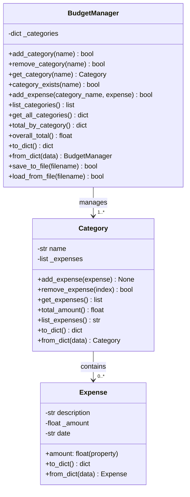

# Personal Budget & Expense Tracker

A console-based Python application that helps users track their spending across different expense categories. All data is persisted to JSON files for later retrieval.

## Project Overview

This mini-project covers fundamental Object-Oriented Programming concepts including:
- **Classes & Objects**: Expense, Category, and BudgetManager classes
- **Encapsulation**: Private attributes with property-based validation
- **Composition**: Categories contain multiple Expense objects
- **Collections**: Managing dictionaries and lists of objects
- **File I/O & JSON**: Serialization and deserialization of complex objects
- **Application Structure**: Menu-driven console interface

## Architecture & Class Diagram



## Project Structure

```
mini-project/
├── expense.py           # Expense class
├── category.py          # Category class
├── budget_manager.py    # BudgetManager class
├── main.py              # Console application & menu
└── budget_data.json     # Saved budget data (auto-generated)
```

## Features

### Core Functionality
- **Add Categories**: Create new expense categories (e.g., Food, Transport)
- **Add Expenses**: Record expenses with description, amount, and date
- **View Expenses**: Display all expenses in a selected category
- **Calculate Totals**: View spending per category and overall total
- **Remove Expenses**: Delete individual expenses from categories
- **Persist Data**: Save and load budget data to/from JSON files
- **Input Validation**: Amount validation, error handling

### Advanced Features
- **Property-based Validation**: Amount must be positive (encapsulation)
- **JSON Serialization**: Complex object serialization and deserialization
- **Interactive Menu**: User-friendly console interface
- **Comprehensive Documentation**: Docstrings for all classes and methods

## Usage

### Running the Application

```bash
cd mini-project
python main.py
```

### Interactive Menu

```
==================================================
Personal Budget & Expense Tracker
==================================================
1. Add a new category
2. Add an expense to a category
3. View expenses in a category
4. View total per category
5. View overall total
6. Remove an expense
7. Save data
8. Load data
9. List all categories
0. Exit
==================================================
```


## Testing

Comprehensive unit tests are provided to validate all core functionality:

```bash
pytest tests/test_budget_tracker.py -v
```


## Possible Extensions

- Add monthly budget limits and warnings
- Add CSV export functionality
- Add expense editing functionality
- Add date range filtering
- Add spending analytics and charts
- Add category-based statistics
- Add recurring expense tracking
- Add multi-currency support

## Author

Created as an educational mini-project demonstrating OOP concepts in Python.
